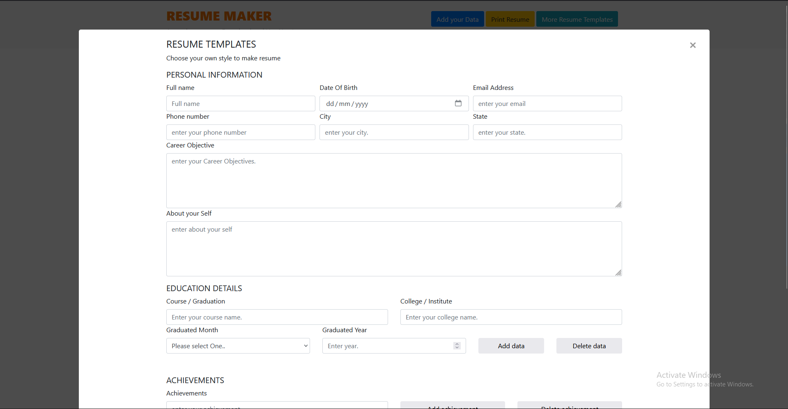
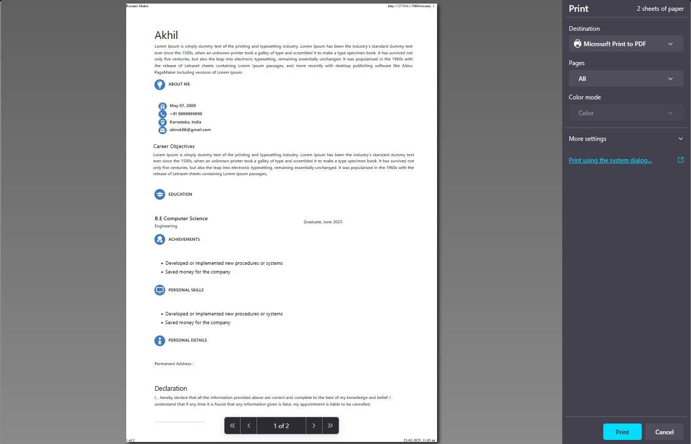

# resume-builder
A resume builder application with integrated ci-cd pipeline for deployment.

Contributions:
Amey Patil: Responsible for creating Application and setting up Git repository.
Jeevottam Hulekal: Responsible for testing application, testing application load.
K Goutham: Responsible for creating docker image and container, also testing usage of application.
Akhilesh Kanagali: Resposible for pipeline setup using Jenkins and deploying docker image using Kubernetes cluster.

